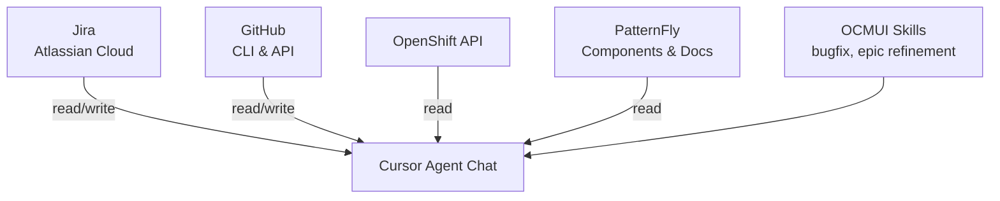
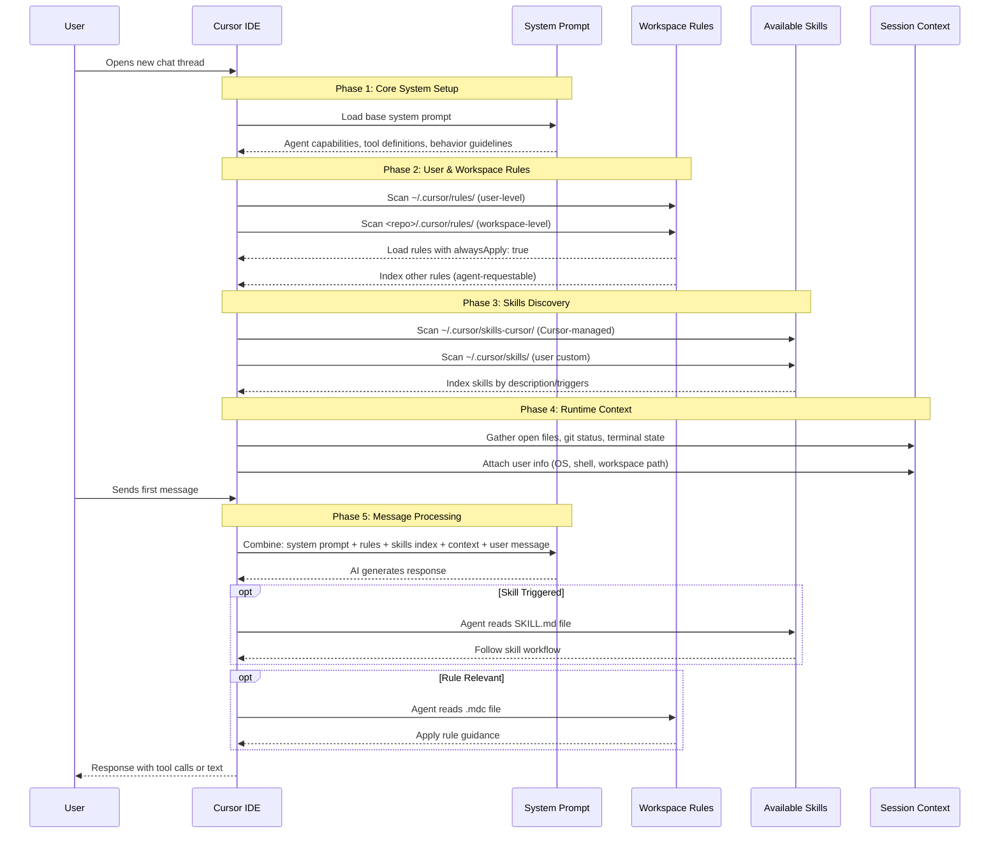

# Cursor IDE: Rules, Skills, and Session Context

This document captures findings about how Cursor IDE organizes AI assistant context, including rules, skills, and session initialization.

**Goal:** Enable every OCMUI team member to configure their Cursor IDE so that any new AI chat can immediately answer these questions — no additional context needed:

```
According to the session context, what project am I working on?
What OCMUI-specific skills are available in this repo?
What OCM APIs are available to the UI?
When POSTing to /api/clusters_mgmt/v1/clusters, what auto_node schema is defined?
For a PatternFly ExpandableSection, what is the code for implementing custom toggle content?
What are the properties of PatternFly DataListItemCells?
Can you fetch Jira ticket OCMUI-XXXX and show me the summary?
What are the latest comments on PR #XXX?
Help me refine epic OCMUI-XXXX
Help me create child stories for epic OCMUI-XXXX
Help me fix bug OCMUI-XXXX
```



---

## Advanced Prompts

Once your setup is working, try these more advanced prompts:

1. Add a comment to OCMUI-XXXX summarizing our chat findings
2. Based on our GitHub pull request template, create a new draft PR for \<description\>
3. Amend last commit and force-push to my fork
4. Help me scrub bug OCMUI-XXXX
5. For OCMUI-XXXX, find its parent and summarize status + latest comments from each open child issue
6. Based on our Jira epic template, create a new epic based on DDR...
7. Create child implementation stories for epic OCMUI-XXXX based on DDR...

---

## Table of Contents

1. [Advanced Prompts](#advanced-prompts)
2. [Key Concepts](#key-concepts)
3. [Rules vs Skills](#rules-vs-skills)
4. [Session Context](#session-context)
5. [Directory Structure](#directory-structure)
6. [Templates](#templates)
7. [Team Sharing Strategy](#team-sharing-strategy)
8. [New Developer Onboarding](#new-developer-onboarding)
9. [Appendix A: Model Selection Guidance](#appendix-a-model-selection-guidance)
10. [Appendix B: Interaction Modes](#appendix-b-interaction-modes)
11. [Appendix C: Security Considerations](#appendix-c-security-considerations)
12. [Appendix D: Jira Instances](#appendix-d-jira-instances)
13. [Appendix E: Rule Loading Strategies](#appendix-e-rule-loading-strategies)
14. [Appendix F: How a New Chat Thread Initializes](#appendix-f-how-a-new-chat-thread-initializes)
15. [Appendix G: Cursor vs Claude Comparison](#appendix-g-cursor-vs-claude-comparison)

---

## Key Concepts

### What is `.mdc`?

**MDC = Markdown Configuration** (or "Markdown Cursor")

It's Cursor's custom file extension for rule files. The difference from plain `.md`:

| Extension | Frontmatter | Cursor Behavior |
|-----------|-------------|-----------------|
| `.md` | Optional, ignored | Treated as regular markdown |
| `.mdc` | Required, parsed | `alwaysApply`, `description` control when rule is loaded |

Example `.mdc` file:
```yaml
---
description: When to suggest this rule to the agent
alwaysApply: true    # If true, always included in context
---

# Regular markdown content here
```

## Rules vs Skills

| Aspect | Rules (`.mdc`) | Skills (`SKILL.md`) |
|--------|----------------|---------------------|
| **Purpose** | Context, guidelines, conventions, standards | Procedural workflows, multi-step tasks |
| **Location (user)** | `~/.cursor/rules/` | `~/.cursor/skills/` or `~/.cursor/skills-cursor/` |
| **Location (repo)** | `<repo>/.cursor/rules/` ✅ | `<repo>/.cursor/skills/` ❓ (not auto-detected) |
| **Auto-apply** | Yes, if `alwaysApply: true` | No, must be triggered |
| **Trigger** | Always or agent discretion | Keywords in skill description |
| **Behavior** | Passive context | Active workflow (read & follow) |
| **Team sharing** | Easy via git | Manual setup per developer |

### When to Use Each

**Use a Rule when:**
- Defining coding conventions (naming, style, patterns)
- Setting project-specific context (tech stack, APIs)
- Providing reference links (docs, guidelines)
- Content is relatively static guidance

**Use a Skill when:**
- Defining a multi-step workflow (e.g., "create a DDR")
- The agent should follow specific steps in order
- There are conditional branches or decision points
- The workflow involves multiple tools (Jira, git, file editing)

---

## Session Context

The file `.cursor/rules/session-context.mdc` is the central context file for OCMUI. It uses `alwaysApply: true`, meaning it is automatically loaded into every new Cursor AI agent chat.

### What It Contains

- **Project identity** — "You are working as a UI engineer in OCMUI (console.redhat.com/openshift)"
- **GitHub repo** — Correct organization (`RedHatInsights/uhc-portal`) and example `gh` commands
- **Jira API access** — How to fetch OCMUI tickets using `$JIRA_EMAIL` and `$JIRA_TOKEN` environment variables
- **Available skills** — Points to `.cursor/skills/` for DDR refinement and bugfix workflows
- **OCMUI Templates** — DDR template, Jira issue templates (epic, story, task, bug), and GitHub PR template
- **PatternFly guidelines** — UI component usage and web search instructions
- **OCM API references** — List of available APIs and how to look up schemas
- **Project scripts** — Common commands (`yarn test`, `yarn lint`, etc.)

### Why This Matters

Because `session-context.mdc` is always loaded, any new chat immediately knows:
1. What project you're working on
2. Where to find skills for complex workflows
3. Where to find templates for Jira issues
4. How to access external APIs (Jira, GitHub, OCM)

---

## Directory Structure

### Proposed Setup for Team Sharing

```
<repo>/
└── .cursor/
    ├── rules/                        # Workspace rules (shared via git)
    │   ├── session-context.mdc       # alwaysApply: true
    │   ├── react-rules.mdc           # Existing team rules...
    │   ├── unit-test-rules.mdc       # Existing team rules...
    │   └── ...
    ├── skills/                       # Workspace skills (referenced via session-context.mdc)
    │   ├── ocmui-refinement/
    │   │   └── SKILL.md
    │   └── bugfix/
    │       └── SKILL.md
    ├── setup-tokens.sh               # Token setup template (macOS/Linux)
    ├── setup-tokens.ps1              # Token setup template (Windows)
    └── templates/
        ├── ddr-template.md           # DDR (Design Decision Record) template
        └── jira/                     # Jira issue templates
            ├── epic-description.md
            ├── story-description.md
            ├── task-description.md
            └── bug-description.md
```

---

## Templates

Templates provide consistent formatting for DDRs, Jira issues, and GitHub PRs. They are stored in known locations so the AI can reference them.

### DDR Template

Located at `.cursor/templates/ddr-template.md`.

The DDR (Design Decision Record) template defines the structure for feature design documents:
- Metadata table (Date, Status, Authors, Sponsor, governing ADRs/STRATs)
- Sections: What, User Stories, Why, How, Tracking, References, Alternatives, Acceptance Criteria, Reviews

Used by the `ocmui-refinement` skill when drafting DDRs for new features.

### Jira Templates

Located in `.cursor/templates/jira/`:

| Template | Purpose | Used By |
|----------|---------|---------|
| `epic-description.md` | Epic structure (Description, Acceptance Criteria, Mockups, Out of Scope, Testing, Implementation Notes) | ocmui-refinement skill |
| `story-description.md` | Story format (User Story, Acceptance Criteria, Implementation Details) | ocmui-refinement skill |
| `task-description.md` | Task format for non-user-facing technical work (refactoring, tech debt) | general use |
| `bug-description.md` | Bug report format (User Impact, Environment, Steps to Reproduce, Expected/Actual Result) | bugfix skill |

These templates are referenced by skills but are also listed in `session-context.mdc`, so the AI knows they exist even without activating a skill.

### GitHub PR Template

Located at `.github/pull_request_template.md` (standard GitHub location).

This template is automatically used by GitHub when creating PRs. The AI can read it to understand the expected PR format:
- Summary section
- Jira link
- How to Test
- Screen captures (Before/After)
- QE Reviewer checklist

**Note:** The GitHub PR template lives outside `.cursor/` because it's a GitHub feature, not a Cursor feature. GitHub automatically populates new PRs with this template.

---

## Team Sharing Strategy

### Proposed Strategy: Session Rule Points to Repo Skills

Keep skills in the repo at `.cursor/skills/`, and have `session-context.mdc` tell the agent to check that directory:

```markdown
## Available Skills

When the user mentions DDR, refinement, bugfix, or asks for help with a structured process, 
check `.cursor/skills/` for relevant skills and read the appropriate `SKILL.md` file.
```

**Pros:**
- Skills are in repo (shared via git)
- No user-specific paths
- No symlinks needed
- Agent reads skills when relevant keywords are mentioned

**Cons:**
- Agent must be triggered (no Cursor-native auto-detection)
- Relies on session rule being applied

### Alternative: Symlinks to User Skills Directory

For native Cursor skill auto-detection, developers can symlink repo skills to their user directory:

```bash
# One-time setup per developer
ln -s /path/to/uhc-portal/.cursor/skills/ocmui-refinement ~/.cursor/skills/ocmui-refinement
ln -s /path/to/uhc-portal/.cursor/skills/bugfix ~/.cursor/skills/bugfix
```

**Why this might be better:**
- **Native auto-detection** — Cursor automatically indexes `~/.cursor/skills/` and triggers skills based on their description keywords
- **No session rule dependency** — Skills work even if `session-context.mdc` isn't loaded
- **Consistent with Cursor's design** — Uses the intended skill discovery mechanism

**Why we didn't choose this:**
- **Per-developer setup** — Each team member must create symlinks manually
- **Absolute paths** — Symlinks break if repo moves or on different machines
- **Cross-platform issues** — Windows symlinks require admin privileges or developer mode

For teams where all developers use macOS/Linux and have consistent paths, the symlink approach may be preferable.

---

## Quick Reference: Where Things Go

| Content Type | Location | Shared via Git? | Editable? |
|--------------|----------|-----------------|-----------|
| Project conventions, coding standards | `<repo>/.cursor/rules/*.mdc` | ✅ Yes | Yes (files) |
| Session context (APIs, tools, project identity) | `<repo>/.cursor/rules/session-context.mdc` | ✅ Yes | Yes (files) |
| Multi-step workflows (DDR, bugfix) | `<repo>/.cursor/skills/{name}/SKILL.md` | ✅ Yes | Yes (files) |
| Templates (DDR, Jira issues) | `<repo>/.cursor/templates/` | ✅ Yes | Yes (files) |
| Tokens and credentials | Environment variables (via `~/ocmui-tokens.sh`) | ❌ No | Yes (local file) |
| Personal user skills | `~/.cursor/skills/` | ❌ No | Yes (files) |
| Cursor-managed skills | `~/.cursor/skills-cursor/` | ❌ No | No (managed by Cursor) |
| Personal global rules | Cursor Settings → Rules for AI | ❌ No | Yes (in app UI) |

## New Developer Onboarding

When a new developer clones the repo:

```bash
# 1. Copy the token setup script OUTSIDE the repo
cp .cursor/setup-tokens.sh ~/ocmui-tokens.sh

# 2. Edit the script and fill in your actual token values
# (Get tokens from the URLs listed in the script)

# 3. Add to your shell config (~/.bashrc or ~/.zshrc)
echo 'source ~/ocmui-tokens.sh' >> ~/.bashrc

# 4. Open a NEW terminal window (so .bashrc is loaded)

# 5. Verify tokens are available in the new shell
echo $JIRA_EMAIL   # Should print your email
```

**Windows users:** Use `.cursor/setup-tokens.ps1` instead (run in PowerShell as Administrator).

**Where to get tokens:**
- **GitHub**: https://github.com/settings/tokens (or use `gh auth login`)
- **Jira Cloud (Atlassian)**: https://id.atlassian.com/manage-profile/security/api-tokens

**Why environment variables?** Tokens stored in env vars are NOT sent to AI models. If tokens were in files that the AI reads, they would be exposed to the LLM.

### Verifying Your Setup

Open a **new chat thread** and paste all these questions:

```
According to the session context, what project am I working on?
What OCMUI-specific skills are available in this repo?
What OCM APIs are available to the UI?
When POSTing to /api/clusters_mgmt/v1/clusters, what auto_node schema is defined?
For a PatternFly ExpandableSection, what is the code for implementing custom toggle content?
What are the properties of PatternFly DataListItemCells?
Can you fetch Jira ticket OCMUI-XXXX and show me the summary?
What are the latest comments on PR #XXX?
```

[OCMUI enabled Cursor Chat Answers](https://gist.github.com/dtaylor113/3cba0134e3ccfa330198eecc87193ee1)

---

## Appendix A: Model Selection Guidance

Different tasks benefit from different model tiers. Use lower-cost models for simple lookups; reserve high-reasoning models for complex workflows.

| Task Type | Recommended Model | Why |
|-----------|-------------------|-----|
| **Simple lookups** (project context, skill list, API schemas) | Default / Fast | Straightforward reads from rules or codebase |
| **API calls** (fetch Jira ticket, PR comments) | Default / Fast | Tool execution, minimal reasoning |
| **Documentation lookups** (PatternFly props, code patterns) | Default | Web search + pattern matching |
| **Multi-step workflows** (refine epic, bugfix, create stories) | `claude-4.5-opus-high-thinking` | Complex reasoning, multi-phase decisions, tool orchestration |
| **Architecture decisions** (DDR drafting, design tradeoffs) | `claude-4.5-opus-high-thinking` | Requires deep analysis and synthesis |

**Practical tip:** Start a chat with the default model. If the task involves a skill workflow or requires significant reasoning, switch to `claude-4.5-opus-high-thinking` before invoking the skill.

---

## Appendix B: Interaction Modes

Cursor offers different interaction modes optimized for specific workflows. The agent can switch modes automatically, or you can request a switch.

| Mode | Purpose | Tools Available | When to Use |
|------|---------|-----------------|-------------|
| **Agent** | Default implementation mode | Full access (read, write, shell, etc.) | Clear tasks ready for implementation |
| **Plan** | Collaborative design before coding | Read-only | Large/ambiguous tasks, architectural decisions, exploring trade-offs |
| **Ask** | Explore and answer questions | Read-only, no MCP | Understanding code, asking "how does X work?" |
| **Debug** | Systematic troubleshooting | Full access | Investigating bugs, failures, unexpected behavior |

### When to Use Each Mode

**Agent Mode** (default):
- You have a clear understanding of what to implement
- The task is straightforward with an obvious approach
- You've already planned/debugged and are ready to code

**Plan Mode**:
- The task has multiple valid approaches with significant trade-offs
- Architectural decisions needed (e.g., "Add caching" → Redis vs in-memory vs file-based?)
- Large refactors or migrations touching many files
- Requirements are unclear — need to explore before understanding scope
- You want to discuss the approach before any code changes

**Ask Mode**:
- Exploring unfamiliar parts of the codebase
- "How does this work?" or "Where is X defined?"
- Learning about patterns without making changes
- Quick lookups that don't require tool execution

**Debug Mode**:
- An error, bug, or unexpected behavior requires investigation
- Need to trace execution flow with runtime evidence
- Multiple failed attempts suggest a systematic approach is needed

### Mode Switching Tips

- The agent can switch modes proactively — if it suggests switching, that's usually a good signal
- Start in **Agent** for straightforward tasks; let the agent suggest **Plan** if complexity emerges
- For OCMUI skills (bugfix, refinement), **Agent** mode with `opus-high-thinking` is typically best
- Switch to **Plan** before starting a DDR if you want to discuss the approach first

---

## Appendix C: Security Considerations

When using AI coding assistants, be aware of how sensitive data is handled.

### What Gets Sent to the LLM

| Data Type | Sent to LLM? | Example |
|-----------|--------------|---------|
| File contents the AI reads | ✅ Yes | If AI reads a file with tokens, those tokens are sent |
| Shell command text | ✅ Yes | The command string itself |
| Shell command output | ✅ Yes | API responses, logs, etc. |
| Environment variable **names** | ✅ Yes | `$JIRA_TOKEN` as a string |
| Environment variable **values** | ❌ No* | The actual token value stays local |

*Unless the AI runs a command that prints them (e.g., `echo $JIRA_TOKEN` or `env`).

### Why We Use Environment Variables

**Problem:** If tokens are stored in files (like `local-context.mdc`), and the AI reads those files, the tokens are sent to the LLM provider (e.g., Anthropic/Claude).

**Solution:** Store tokens in environment variables set via `~/.bashrc`. The AI sees `$JIRA_TOKEN` in commands, but the shell expands it locally — the actual value never leaves your machine.

### Setup Summary

```
~/ocmui-tokens.sh          ← Your actual tokens (never read by AI)
    ↓ (sourced by)
~/.bashrc                  ← Loads tokens into shell environment
    ↓ (inherited by)
Cursor shell processes     ← Have access to $JIRA_TOKEN etc.
    ↓ (AI uses)
curl -u "$JIRA_TOKEN"...   ← Token expands locally, not sent to LLM
```

### Best Practices

1. **Never store tokens in files the AI reads** — use env vars instead
2. **Don't ask the AI to run `env` or `printenv`** — this would expose values
3. **Rotate tokens periodically** — especially if they may have been exposed
4. **Keep `~/ocmui-tokens.sh` outside the repo** — it should never be committed

---

## Appendix D: Jira Instances

Red Hat uses **two separate Jira systems**:

| Instance | URL | Used For |
|----------|-----|----------|
| **Atlassian Cloud** | `redhat.atlassian.net` | OCMUI tickets (OCMUI-XXXX) |
| **Red Hat Self-Hosted** | `issues.redhat.com` | Platform tickets (ROSA-, OCM-, CS-, etc.) |

### Cursor AI Access

The Cursor AI agent uses **curl** to access Atlassian Cloud for OCMUI tickets. Credentials are stored in environment variables (`$JIRA_EMAIL`, `$JIRA_TOKEN`).

### Jira CLI Configuration

The `jira` CLI can only point to **one instance at a time**. By default, many Red Hat developers have it configured for `issues.redhat.com`.

**To configure for Atlassian Cloud (OCMUI tickets):**

```bash
jira init --installation cloud \
  --server https://redhat.atlassian.net \
  --login your-email@redhat.com \
  --auth-type basic \
  --project OCMUI
```

You'll be prompted for an API token. Generate one at:
https://id.atlassian.com/manage-profile/security/api-tokens

**Note:** This will overwrite your existing jira CLI config. If you need access to both Jira instances, either:
- Use `jira` CLI for one and `curl` for the other
- Use separate config files with `JIRA_CONFIG_FILE` env var

---

## Appendix E: Rule Loading Strategies

The `.mdc` frontmatter controls when and how rules are loaded into the AI's context.

### Frontmatter Options

```yaml
---
description: Text that helps Cursor decide when to suggest this rule
alwaysApply: true    # or false/omitted
---
```

| Setting | Behavior | Use Case |
|---------|----------|----------|
| `alwaysApply: true` | Always included in every conversation | Core project context, coding standards |
| `alwaysApply: false` | Indexed, suggested when `description` keywords match | Specialized workflows, optional guidance |
| `description` only | Agent can request when relevant | Reference material, rarely-needed info |

### Strategy Comparison

| Strategy | Context Cost | Reliability | Best For |
|----------|--------------|-------------|----------|
| **Always Apply** | High (always loaded) | 100% available | Essential context every chat needs |
| **Keyword Triggered** | Low (on-demand) | ~80% (may miss) | Specialized tasks with clear triggers |
| **Agent Requestable** | Lowest | Variable | Deep reference docs |

### Writing Effective Descriptions

For `alwaysApply: false` rules, the `description` field is critical — it's how Cursor decides to suggest the rule.

**Good descriptions:**
- Include trigger keywords: "Use when user mentions **DDR**, **refinement**, **epic**"
- Describe the task type: "Bug scrubbing and resolution workflow"
- Be specific: "OCMUI Interruption Catcher duties"

**Example:**
```yaml
description: >-
  Assist with OCMUI feature refinement and DDR creation.
  Use when the user mentions DDR, refinement, OCMUI epic, 
  feature refinement, or implementation stories.
```

### Recommendations by Rule Type

| Rule Type | Recommended Setting | Rationale |
|-----------|---------------------|-----------|
| Project identity (what repo, team, tech stack) | `alwaysApply: true` | Needed in every conversation |
| Coding standards (React, TypeScript) | `alwaysApply: true` | Should always influence code |
| API references (PatternFly, OCM) | `alwaysApply: false` | Only needed for specific tasks |
| Multi-step workflows (DDR, bugfix) | Skill, not rule | Too procedural for passive context |

### Skills vs Rules with alwaysApply

Skills (`.cursor/skills/*/SKILL.md`) and rules with `alwaysApply: false` both use keyword triggering, but:

| Aspect | Skill | Rule (alwaysApply: false) |
|--------|-------|---------------------------|
| Format | `SKILL.md` with frontmatter | `.mdc` with frontmatter |
| Purpose | Procedural workflows | Passive context/guidelines |
| Agent behavior | Reads and follows steps | Applies as background context |
| Location | `~/.cursor/skills/` or repo | `~/.cursor/rules/` or repo |

**Rule of thumb:** If the content says "do X, then Y, then Z", it's a skill. If it says "when doing X, follow these guidelines", it's a rule.

---

## Appendix F: How a New Chat Thread Initializes

When you start a new Cursor AI chat, the system assembles context in a specific order:



### Key Points

1. **System prompt** is always first - defines agent capabilities and behavior
2. **Rules with `alwaysApply: true`** are automatically included in every conversation
3. **Other rules** are indexed and available on-demand (agent decides when relevant)
4. **Skills** are indexed by their description - triggered when keywords match user input
5. **Skills are NOT auto-read** - agent must explicitly read the SKILL.md file when triggered

---

## Appendix G: Cursor vs Claude Comparison

| Feature | Cursor IDE | Claude Code |
|---------|------------|-------------|
| Config directory | `.cursor/` | `.claude/` |
| Rules file | `.cursor/rules/*.mdc` | `CLAUDE.md` at project root |
| Skills directory | `.cursor/skills/` | `.claude/skills/` |
| Invocation | Keyword triggers + session rules | Slash commands (`/scrub`) |
| State management | Stateless (each chat fresh) | Stateful (tracks phases) |

If supporting both platforms, maintain parallel structures:
```
project/
├── .claude/           # For Claude Code
│   └── skills/
├── .cursor/           # For Cursor IDE
│   ├── rules/
│   └── skills/
└── CLAUDE.md          # Claude reads this automatically
```

---

*Last updated: 2026-05-01*
